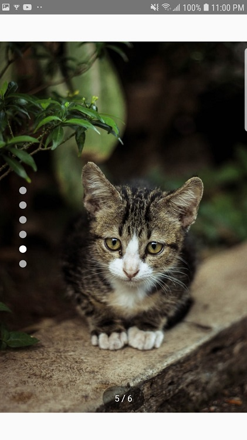

# AndroidSliderViewSample
This is a sample Android project to demonstrate how to use Android Slider library created by sung2063. 
The sample app includes using of <b>Horizontal and Vertical CarouselViews</b> and <b>SlideshowView</b>.

## Screenshots

  <table>
    <tr style="border-collapse: collapse;">
      <td></td>
      <td></td>
      <td></td>
    </tr>
    <tr>
      <td>Horizontal Carousel</td>
      <td>Vertical Carousel</td>
      <td>Slideshow</td>
    </tr>
   </table>
 

 
 
 ## GIF Images

  <table>
    <tr style="border-collapse: collapse;">
      <td></td>
      <td></td>
    </tr>
    <tr>
      <td>Horizontal Carousel</td>
      <td>Vertical Carousel</td>
    </tr>
   </table>
 

## Instruction

1) Clone the AndroidSliderViewSample repository to your local computer
2) Open the project on Android Studio
3) Run the program either on Android virtual device or your Android device 

For more information on how to use Android SliderViews library, check out the library link: https://github.com/sung2063/AndroidSliderViewsLibrary
